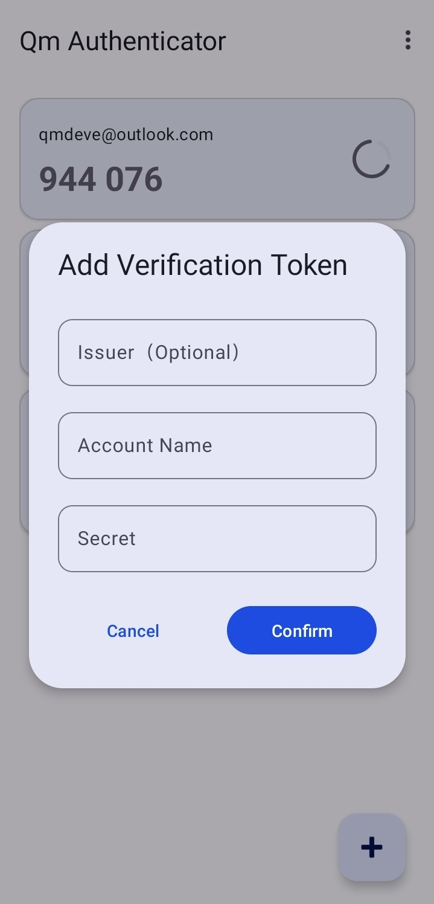
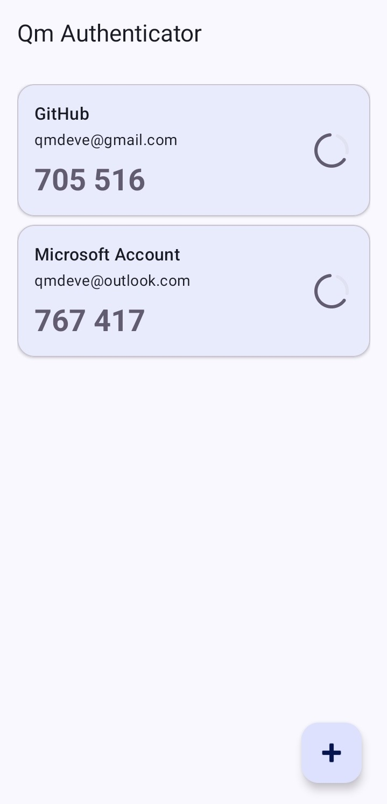

## Qm Authentication for Android
**An open-source, secure, offline two-factor authentication (2FA) application developed for Android. It helps you add an extra layer of security to your online account**

**English | [简体中文](./README_zh.md)**

---

### Characteristic

- **Safety First**：All keys are **completely offline** stored locally on the device and will never be uploaded to any server
- **Open source**：The complete source code is open, and security and privacy are available for anyone to review
- **Standard compatibility**：Supports Time-Based One-Time Password Algorithm (TOTP), compatible with all services using this standard (e.g., Google, GitHub, Microsoft, etc.)
- **Simple and easy to use**：**Material Design 3** is a design style that provides an intuitive and smooth user experience

---

### Screenshot

|                 Add Account                 |           Verification code list            |
|:-------------------------------------------:|:-------------------------------------------:|
|  |  |

---

### Download and installation
#### Download from GitHub Releases
Go to the [Releases](https://github.com/Rouneant/Qm-Authenticator-for-Android/releases) page to download the latest `app-release.apk` file
