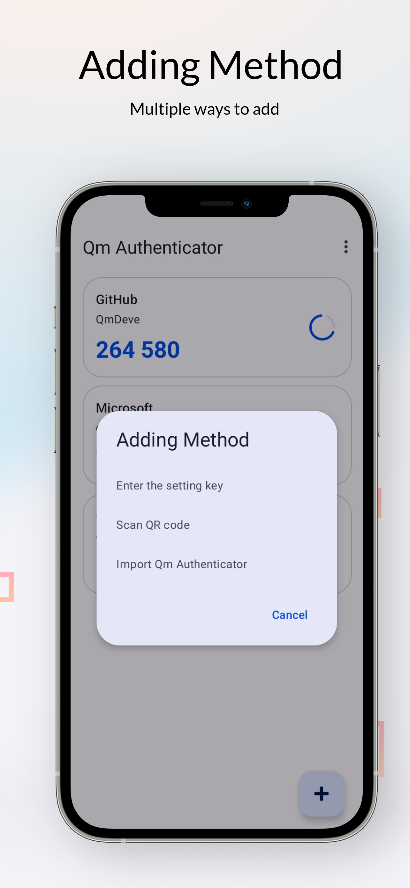

## Qm Authenticator for Android
**Android用に開発された、オープンソース、安全、オフラインの二段階認証（2FA）アプリケーション。それはあなたのオンラインアカウントに追加のセキュリティ保護を一層追加するのに役立ちます**

**[English](./README.md) | [简体中文](./README_zh.md) | [Русский](./README_ru.md) | 日本語**

---

### 特性

- **鍵のセキュリティ**：すべての鍵**完全オフライン**はデバイスのローカルに保存されています
- **オープンソース透明**：完全なソースコードが開放され、安全性とプライバシー性は誰でも審査できます。
- **標準互換性**：時間ベースのワンタイムパスワードアルゴリズム（TOTP）をサポートし、この標準を使用するすべてのサービス（Google、GitHub、Microsoftなど）と互換性があります。
- **簡潔で使いやすい**：**Material Design 3**デザインスタイルは、直観的で流暢なユーザー体験を提供します。

---

### プレビュー

|                                                                                          |                                                                                          |                                                                                          |                                                                                          |
|:----------------------------------------------------------------------------------------:|:----------------------------------------------------------------------------------------:|:----------------------------------------------------------------------------------------:|:----------------------------------------------------------------------------------------:|
|  |  |  |  |

---

### ダウンロードとインストール

  
  
  
   
    
  
  
   
  
  

