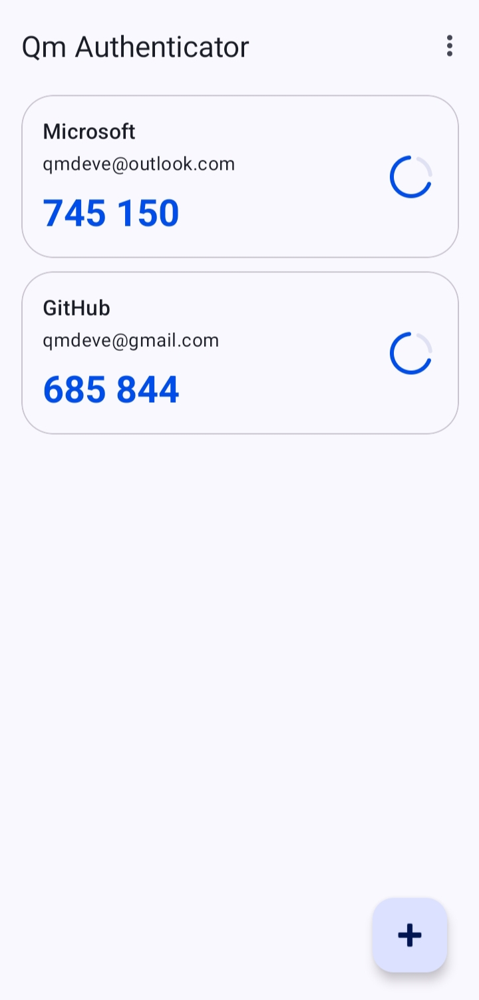
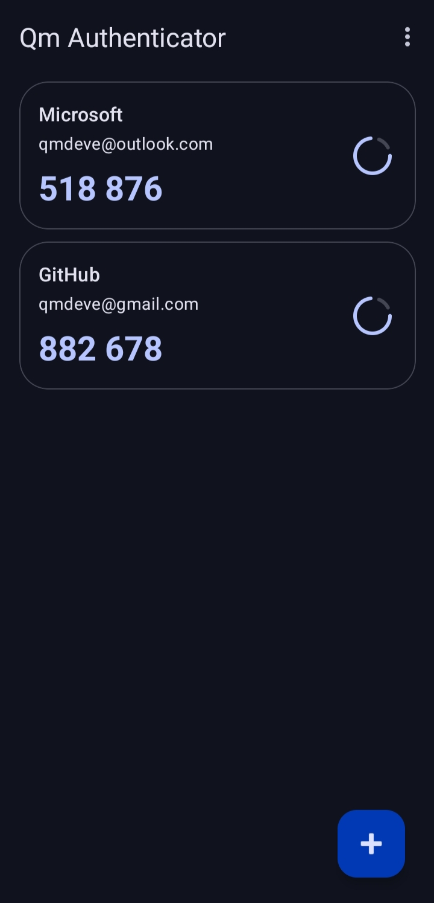
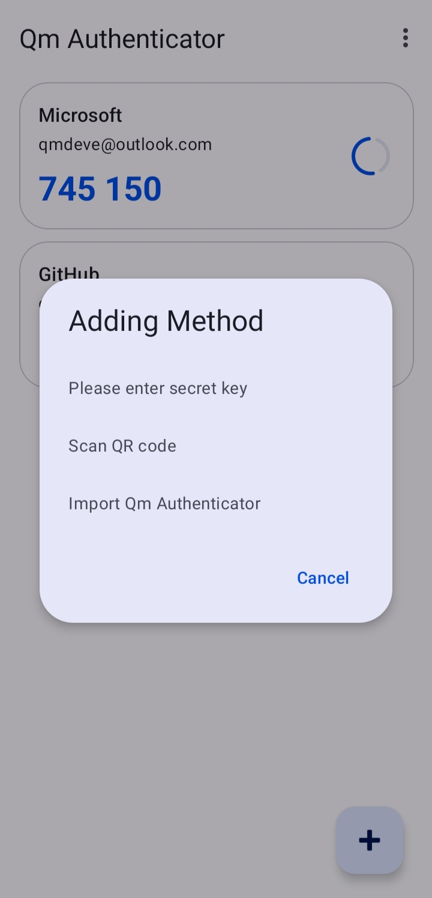
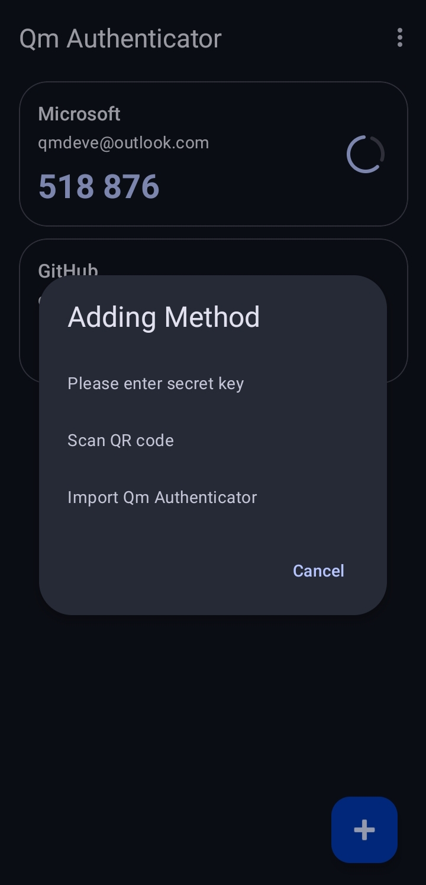
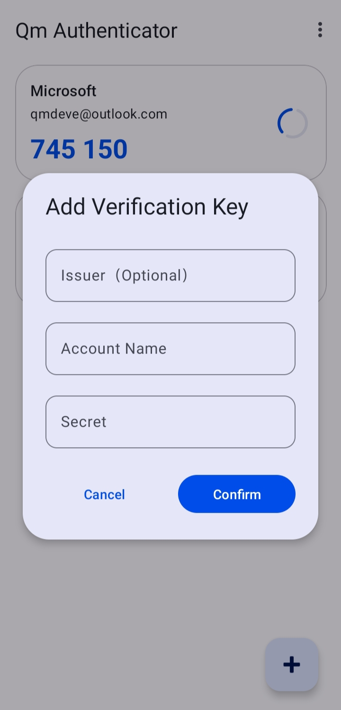
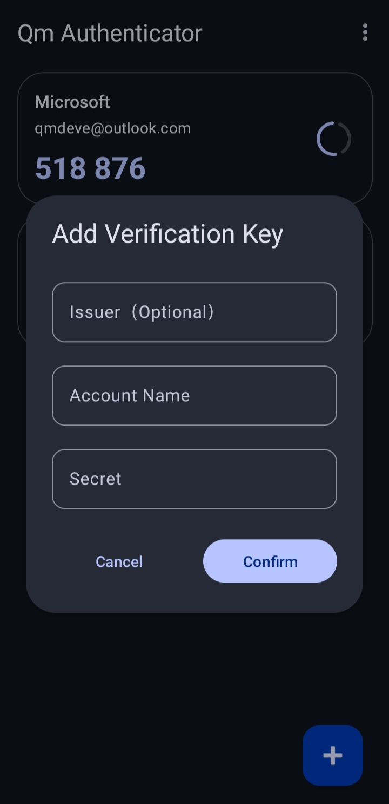

## Qm Authenticator for Android
**Приложение с открытым исходным кодом, безопасное, автономное двухэтапное приложение (2FA)**

**[English](./README.md) | [简体中文](./README_zh.md) | Русский | [日本語](./README_ja.md)**

---

### Характеристика

- **Безопасность ключей**: Все ключи **полностью в автономном режиме** хранятся локально на устройстве и никогда не будут загружены ни на один сервер
- **Открытый исходный код**: Полный исходный код открыт, а безопасность и конфиденциальность могут быть проверены любым.
- **Стандартная совместимость**: Поддерживает алгоритм одноразового пароля на основе времени (TOTP) и совместим со всеми сервисами, использующими этот стандарт (такими как Google, GitHub, Microsoft и т. д.)
- **Простой и удобный в использовании**: **Дизайн материалов 3** Стиль дизайна обеспечивает интуитивно понятный и плавный пользовательский интерфейс.

---

### Скриншот

|                   Light Mode                    |                  Dark Mode                   |
|:--------------------------------------------:|:--------------------------------------------:|
|    |     |
|                     Light Mode                     |                     Dark Mode                     |
| :------------------------------------------: | :------------------------------------------: |
|    |     |
|                     Light Mode                     |                     Dark Mode                     |
| :------------------------------------------: | :------------------------------------------: |
|    |     |
---

### Скачать и установить
#### Скачать с GitHub Releases
Перейдите на страницу [Releases](https://github.com/Rouneant/Qm-Authenticator-for-Android/releases), чтобы загрузить последний файл `app-release.apk`